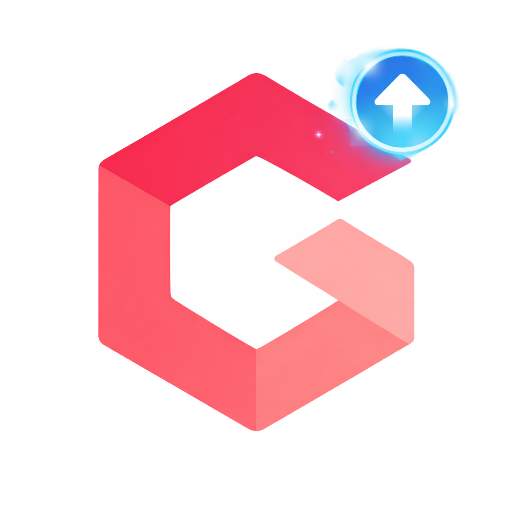
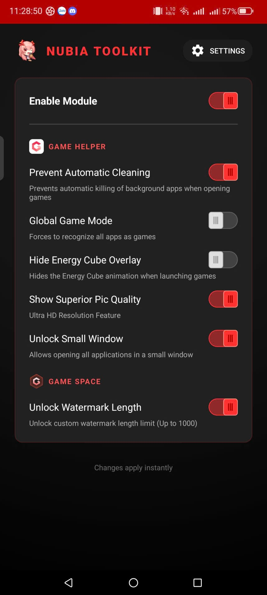
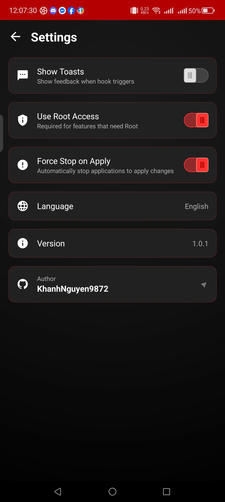
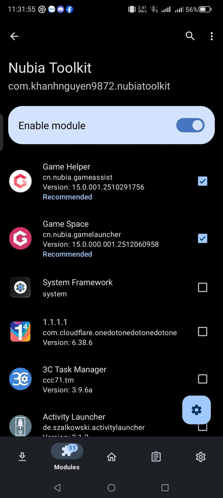
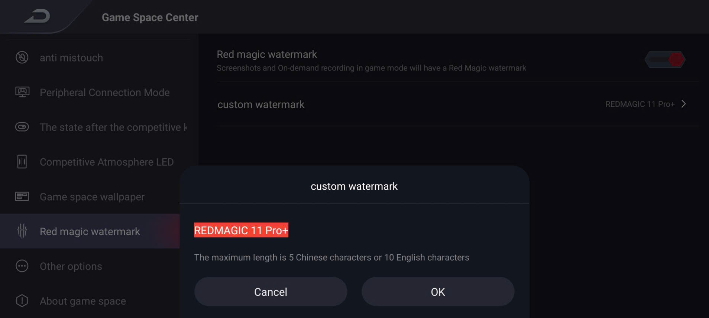
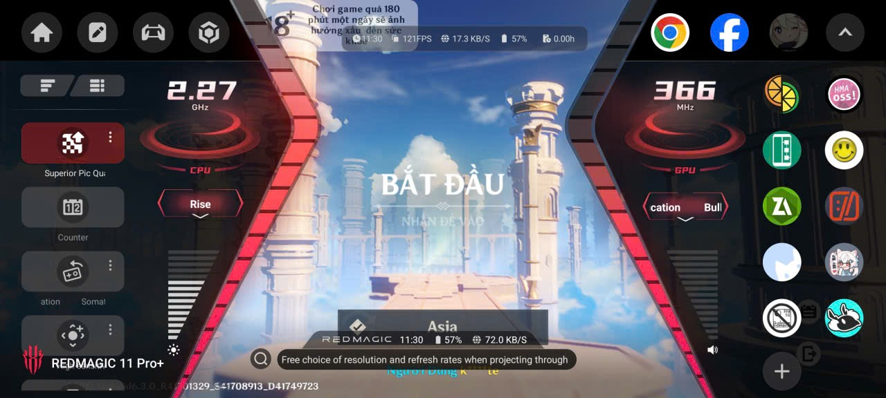
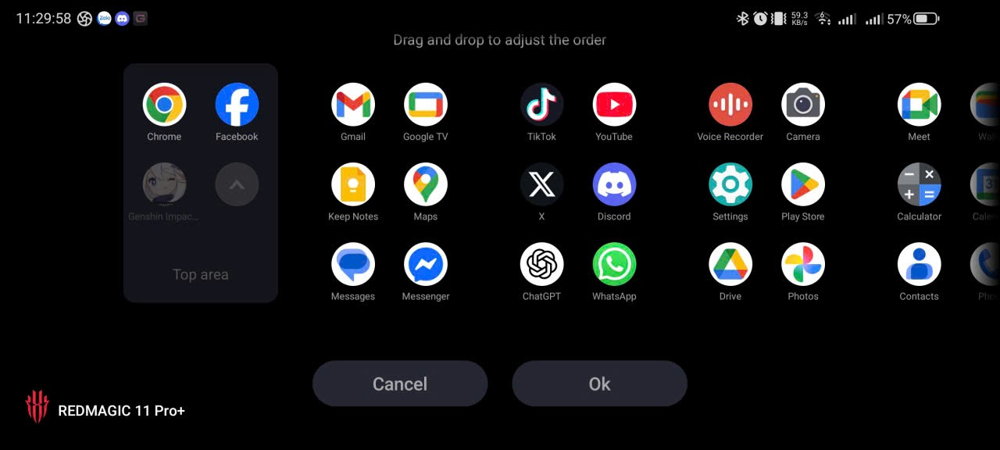

  
  <h1>Nubia Toolkit</h1>
  
<strong>Advanced Customization for RedMagic</strong>   Unlock hidden features and enhance your Nubia RedMagic experience.

## 🌟 Introduction

**Nubia Toolkit** is a powerful Xposed/LSPosed module designed specifically for **Nubia RedMagic** devices. It dives deep into the system framework to unlock hidden capabilities, bypass restrictions, and optimize the gaming experience by modifying system apps like Game Space and Game Assist.

## ✨ Key Features

-   **🔓 Super Resolution Unlock**:
    -   Forces "Superior Pic Quality" to be enabled and visible.
    -   Bypasses device model checks for premium features.
-   **💧 Watermark Limit Removal**:
    -   Type longer custom text in your Camera watermark (bypasses character limit).
-   **🚀 Optimization Tweaks**:
    -   **No Kill Logic**: Prevent aggressive background app killing (configurable).
    -   **Global Game Mode**: Enable game optimizations for any app.
    -   **Hide Energy Cube**: Clean up your UI.
-   **🎮 Game Space Enhancements**:
    -   Hooks into Game Space/Assist for extended functionality.
    -   Widget customizations (Fan, FPS, Health).

## 📱 Screenshots

    
    
    
     
    
    
    

## ⚙️ Requirements

-   **Rooted Nubia RedMagic Device**
-   **LSPosed Framework** (Zygisk or Riru) installed and active.
-   **Android 12+** (Targeting MyOS/RedMagic OS).

## 🚀 Installation

1.  **Download**: Get the latest APK from the [Releases](https://github.com/KhanhNguyen9872/NubiaToolkit/releases) page.
2.  **Install**: Install the APK on your device.
3.  **Activate**:
    -   Open **LSPosed Manager**.
    -   Enable **Nubia Toolkit** module.
    -   Ensure the scope includes **System Framework**, **Game Space**, and **Game Assist**.
4.  **Reboot**: Restart your device to apply hooks.

## 📖 Usage

1.  Open the **Nubia Toolkit** app.
2.  Toggle the features you want to enable.
3.  Grant Root permissions if requested (for "No Kill" or "Force Stop" features).
4.  Use "Force Stop on Apply" to restart target apps without a full reboot (if supported).

## ⚠️ Disclaimer

This software is provided "as is", without warranty of any kind. Modifying system behavior via Xposed carries inherent risks. The developer is **not responsible** for bootloops, data loss, or bricked devices. **Always backup your data** before installing system modules.

## 🤝 Contributing

Contributions are welcome! Please feel free to submit a Pull Request.

## ✍️ Author

**Nguyễn Văn Khánh** (KhanhNguyen9872)

-   GitHub: [@KhanhNguyen9872](https://github.com/KhanhNguyen9872)

## 📄 License

This project is licensed under the Apache License 2.0 - see the [LICENSE](LICENSE) file for details.
